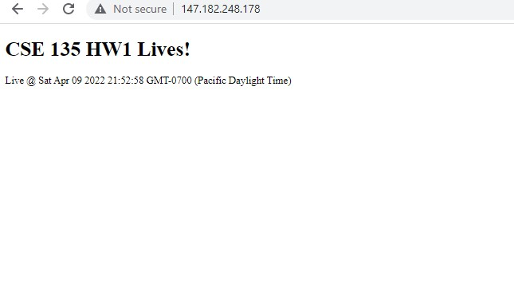

# Digitalocean-project
**CSE135 webserver project**

**Team Member:** Yifu Fang      A15702810

**Website:** http://fangblog.tk

**Username/password for logging into the site:**

    username:yifu
    password:Apple007

**Github auto deploy setup:**

    have our website file ready in local machine
    create a git --bare somewhere in the server, and create post-receive in /hooks which checkout the into working directory
    give permission to execute post-receive "chmod +x post-receive"
    in local machine, git remote add prod ssh://user@domain/bare git directory
    finally git push prod main to deploy

**summary of html file compression:**

    the html, css, js files will be compressed by mod_gzip before sending out.

**summary of removing 'server' header:**

    install "sudo apt-get install libapache2-mod-security2", and which enable modification to etc/apache2/apache2.conf
    then add seccond server signature into the file:
        <IfModule mod_security2.c>
        SecServerSignature "CSE135 server"
        </IfModule>

**Screen shots:**

